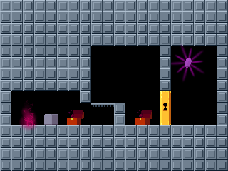
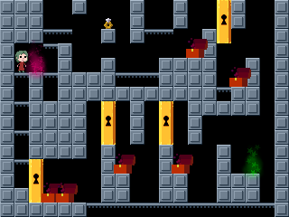

# recursed-xls2lua: Custom level design for Recursed via spreadsheets

This tool lets you design custom levels for the video game
**[Recursed](http://store.steampowered.com/app/497780/Recursed/)**
using a simple spreadsheet input format, as an alternative to
(and converting to) the
[custom level Lua format](http://steamcommunity.com/sharedfiles/filedetails/?id=800043882).

The spreadsheet format also enables easy
[rendering of "screenshots" in SVG format](svgtiler)
using [SVG Tiler](https://github.com/edemaine/svgtiler).
This is how we drew the figures in the 2020 paper
&ldquo;[Recursed is not Recursive:
A Jarring Result](https://arxiv.org/abs/2002.05131)&rdquo;
by Demaine, Kopinsky, and Lynch (ISAAC 2020).

## Examples

### 1. [Very Simple Level](examples/simpletest)

 &rarr; 

### 2. [Undecidability Reduction Example](examples/undecidable)

 

## Input Format

The input file can be any spreadsheet format supported by
[the xlsx package](https://www.npmjs.com/package/xlsx), for example,
`.xlsx` exported from Google Sheets.

Each spreadsheet file corresponds to a level, and each sheet within
the file corresponds to a room.  (The room name is the sheet name.)
Each sheet should be 20 columns wide and 15 rows high.

Each cell in a sheet can be one of the following **objects**.
Some objects (box, key, lock, chest, fan, generics) can be prefixed with
`!` to make them global (glowing green).
In addition, multiple objects can be placed at the same location
by separating them with commas or semicolons.
(But note that the first seven types are tiles, not objects, so you can't
have more than one at the same location.)

Full name | Aliases       | Meaning             | Height
--------- | -------       | -------             | ------
solid     | s             | impassable wall     | 1
ledge     | -             | top edge is a wall  | 1
water     | w             | water tile          | 1
acid      | a             | acid tile           | 1
buoy      | bu            | floating block/wall | 1
glitch    | gl            | glitch tile/wall    | 1
ledgewet  | lw            | glitch tile/wall    | 1
player    | p             | start location      | 2
box       | b             | movable block       | 1
key       | k             | grabbable key       | 1
lock      | l, d, door    | locked door         | 3
chest     | c             | room specified by colon | 1
yield     | y             | green glow creating jar | 1
crystal   | cr, goal      | goal of the level   | 1
diamond   | di            | goal of a paradox   | 1
record    | r             | narration ring, path specified by colon | 1
fan       | f             | paradox fan         | 1
bird      | bi            | restart bird spawn  | 1
generic   | g, o, oobleck | oobleck (copy)      | 1

Alternatively, a room can in its top-left corner a command of the form
`duplicate:name` to make an identical copy of the room with title `name`
(but the duplicate room will have the name of the sheet).
In following rows, you can specify a sequence of transformations.
The first column specifies the transformation; currently, this must be
`replace`.  For `replace` commands, the second and third column specify
a before and after transform (all cells exactly equal to the second column
will be replaced with the third column).

## Installation

Assuming you have [Node and NPM](https://nodejs.org/) installed,
the following command should install a global command `recursed-xls2lua`:

```bash
npm install -g recursed-xls2lua
```

You can also omit the `-g` to get a local installation, in which case
`node_packages/recursed-xls2lua/index.js` is the executable.

## Usage

The primary usage is `recursed-xls2lua filename.xlsx`
which generates `filename.lua`.

You can also specify arguments `-o dirname` to output `filename.lua`
into `dirname` instead of the directory of the `.xlsx` file.
You can use this to export a level directly to Steam:

```bash
## Windows
recursed-xls2lua -o "c:/Program Files (x86)/Steam/steamapps/common/Recursed/custom/missions/" level.xlsx
```

You can specify multiple such arguments to output to multiple directories.
For example, you can add `-o .` to also output to the current directory.

### Expansion

You can also use this tool to just process all `duplicate` rooms and write out
a fully expanded `.xlsx` file.  Specifically,
`recursed-xls2lua -e filename.xlsx` generates `filename-expanded.xlsx`.
Such an expanded spreadsheet can be useful as input to
[svgtiler](https://github.com/edemaine/svgtiler/)
as an alternate rendering engine.
