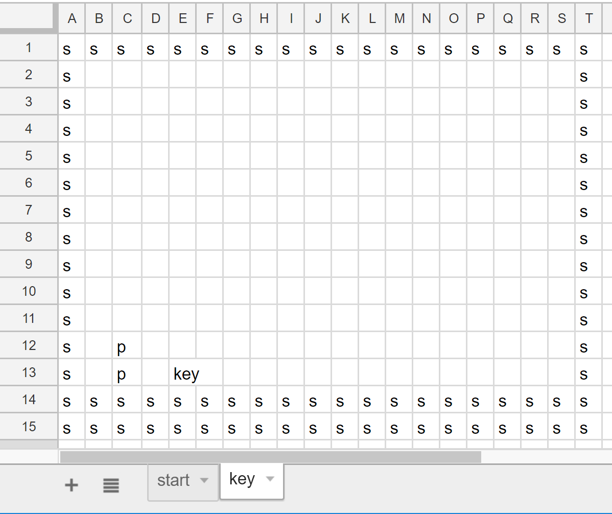
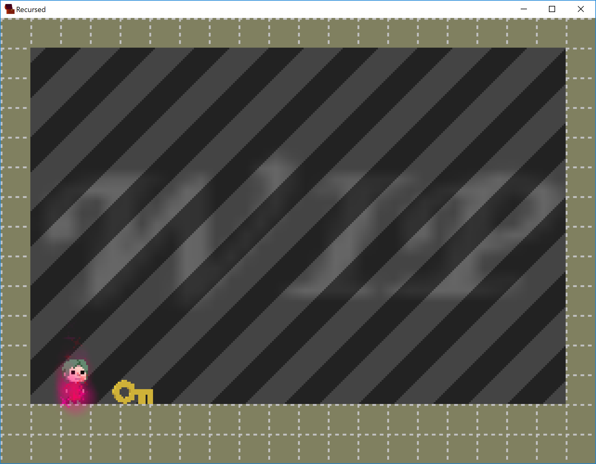

# Simple test example with 2 rooms

## Input spreadsheet:

[.xlsx file](simpletest.xlsx) &bull;
[Google Sheets link](https://docs.google.com/spreadsheets/d/1H486uvCgG6UELDbBFyrXODFlopZaSXFhsJL7e9gxklI/edit?usp=sharing)

## Output level of Recursed:

[Lua level](simpletest.lua)
