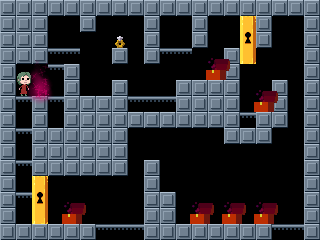
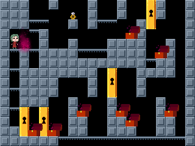
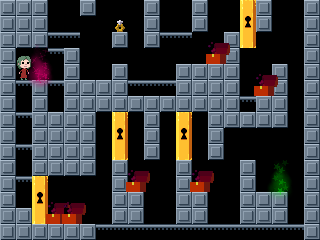
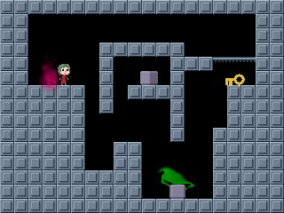
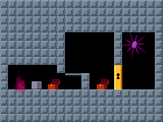
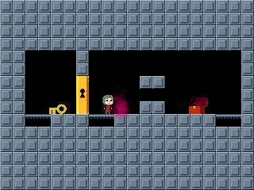
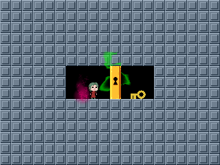

# Undecidability Reduction

## Paper and Result

The 2020 paper &ldquo;[Recursed is not Recursive:
A Jarring Result](https://arxiv.org/abs/2002.05131)&rdquo;
by Demaine, Kopinsky, and Lynch (ISAAC 2020)
proves that deciding whether you can win a level of the video game
[Recursed](http://store.steampowered.com/app/497780/Recursed/) is
[RE-complete](https://en.wikipedia.org/wiki/RE_(complexity)#RE-complete),
which implies that there is no finite algorithm to solve the problem
([undecidability](https://en.wikipedia.org/wiki/Undecidable_problem)).

## Screenshots

Here are "screenshots" (actually [SVG renderings of the rooms](../../svgtiler)
produced by [SVG Tiler](https://github.com/edemaine/svgtiler))
of some of the key rooms in the level
(as generated by the [`Makefile`](Makefile)).
See the paper for details about how the rooms work and interconnect.

       

## Specific Example

The specific level presented here is a minimal example of the reduction
from that paper, representing an instance of the
[Post Correspondence Problem](https://en.wikipedia.org/wiki/Post_correspondence_problem)
with just two dominoes: `[a|ab]` and `[ba|b]`.
The level is winnable (by selecting each domino once in turn),
but it is quite difficult to do so in practice.

## Output Level

[Lua level](undecidable.lua) generated by
[recursed-xls2lua](https://github.com/edemaine/recursed-xls2lua)

To play the level, put the Lua file into Recursed's `custom/missions` folder;
see [these instructions](https://steamcommunity.com/sharedfiles/filedetails/?id=800043882).

## Input Spreadsheet

The level above is generated by
[recursed-xls2lua](https://github.com/edemaine/recursed-xls2lua)
from
[this .xlsx input file](undecidable.xlsx),
which in turn is exported from
[this Google Sheet](https://docs.google.com/spreadsheets/d/1ASqSR9EQF2L-6L6IQ_HYus3htGyc0kWByDrfVtEJnjM/edit?usp=sharing).
