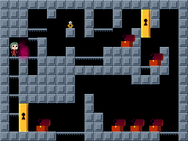
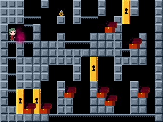
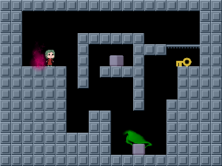
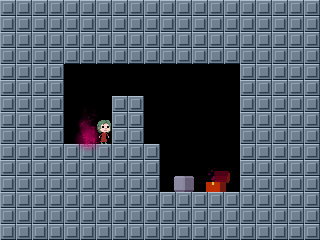
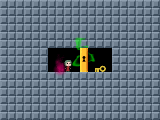

# SVG Tiler Renderings of Recursed Levels

This directory provides a "mapping file", [`recursed.coffee`](recursed.coffee),
that makes it easy to render Recursed levels
directly into SVG drawings using
[SVG Tiler](https://github.com/edemaine/recursed-xls2lua),
without having to actually run the game.
To do so, we use a [set of sprites](sprites)
extracted from screenshots of the game.

These mappings are exactly what we used to generate the figures in
the 2020 paper &ldquo;[Recursed is not Recursive:
A Jarring Result](https://arxiv.org/abs/2002.05131)&rdquo;
by Demaine, Kopinsky, and Lynch (ISAAC 2020).

## Usage

To use SVG Tiler in this way,
first draw your `level.xlsx` in the simplified spreadsheet format of
[recursed-xls2lua](https://github.com/edemaine/recursed-xls2lua).
Then, if you use any `duplicate` room syntax,
[use recursed-xls2lua to expand the rooms](https://github.com/edemaine/recursed-xls2lua#expansion)
into an explicit sheet for each room:
```sh
recursed-xls2lua -e level.xlsx
```
Then run SVG Tiler:
```sh
svgtiler recursed.coffee level-expanded.xlsx
```
For a detailed example, see
[this example Makefile](../examples/undecidable/Makefile).

## Sample Outputs

Some sample SVG outputs from
[the undecidability construction example](../examples/undecidable),
generated by
[the corresponding Makefile](../examples/undecidable/Makefile):

       
